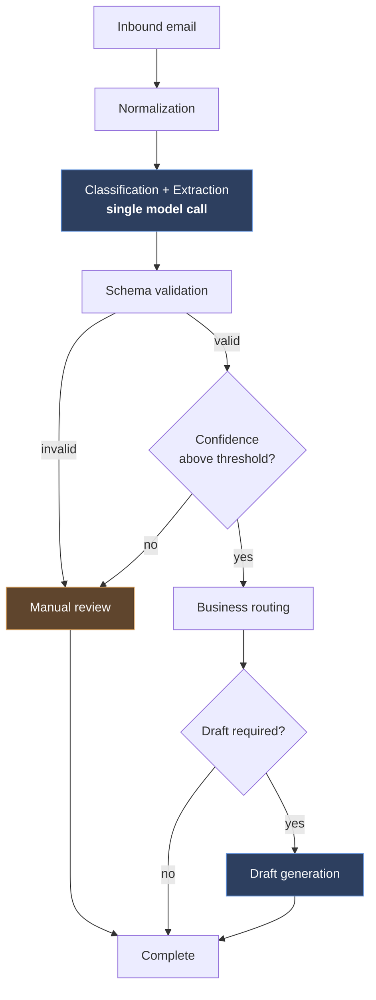

# AI Email Operations Assistant

> An enterprise-inspired automation platform that classifies, enriches, drafts, and routes inbound email using n8n orchestration and large language models.


---

## Overview

Shared inboxes are one of the most expensive unmanaged queues in a business. Support, sales, billing, and operations mail arrives unstructured, is triaged manually, and is routed by tribal knowledge — which makes response times unpredictable and quality inconsistent.

**AI Email Operations Assistant** treats that inbox as a production pipeline. The system is designed to ingest, classify, and structure each inbound message, route it to the owning team, and propose a draft reply where one is warranted — with retries, audit logging, and a human review path designed in from the start rather than added later.

The project is in its documentation and design stage. The [roadmap](#roadmap) reflects what is built; everything else is specified, not yet running.

The project is deliberately built to enterprise software engineering standards: documented architecture, explicit design decisions, a defined data model, and testable components — not a single monolithic automation.

## Designed Capabilities

| Capability | Description |
| --- | --- |
| **Classification & extraction** | Categorizes by intent and urgency and pulls structured business fields into a validated schema — in a **single** model call, so the two can never disagree and cost is not paid twice. |
| **AI draft generation** | Produces context-aware draft replies grounded in the extracted data, generated only for messages that pass the confidence and routing checks. |
| **Intelligent routing** | Directs each message to the correct business team or queue based on classification, confidence, and routing rules. |
| **Retry & failure handling** | Isolates transient failures, applies bounded retries with backoff, and escalates poison messages to a dead-letter path. |
| **Audit logging** | Persists a traceable record of every decision — inputs, model outputs, confidence, and final action — for compliance and debugging. |
| **Human-in-the-loop review** | Low-confidence or high-risk messages are held for manual approval before anything is sent. |

## Architecture



Two properties of this order are deliberate:

- **Classification and extraction are one call, not two.** They read the same message and need the same context. Splitting them doubles cost and latency and allows the two results to disagree.
- **Drafting runs after the confidence and routing checks.** It is the most expensive step, so it is never spent on spam, on messages the model did not understand, or on messages headed for review.

Every step writes an attempt record, and external side effects are dispatched through a transactional outbox rather than called inline. See [`docs/architecture.md`](docs/architecture.md).

Detailed design documentation lives in [`docs/`](docs/):

- [`docs/architecture.md`](docs/architecture.md) — system architecture and component responsibilities
- [`docs/requirements.md`](docs/requirements.md) — functional and non-functional requirements
- [`docs/data-model.md`](docs/data-model.md) — entities, schemas, and persistence design
- [`docs/decisions.md`](docs/decisions.md) — architecture decision records (ADRs)

## Repository Structure

```
ai-email-operations-assistant/
├── api/            # Transactional write block, model abstraction, validation
├── database/       # Schema definitions, migrations, and seed data
├── docker/         # Container definitions and local orchestration
├── docs/           # Architecture, requirements, data model, and ADRs
│   └── architecture/adr/   # Architecture decision records, one file each
├── n8n/            # n8n workflow definitions and exported pipelines
├── prompts/        # Versioned LLM prompt templates
├── sample-data/    # Representative email fixtures for development
└── tests/          # Automated test suites
```

## Technology Stack

| Layer | Technology | Decision |
| --- | --- | --- |
| Workflow orchestration | n8n | — |
| Persistence | PostgreSQL | [ADR-001](docs/architecture/adr/ADR-001-database-choice.md) |
| Intelligence | OpenAI, behind a provider abstraction | [ADR-002](docs/architecture/adr/ADR-002-ai-provider.md) |
| Consistency | Database constraints + transactional outbox | [ADR-003](docs/architecture/adr/ADR-003-idempotency.md) |
| Packaging | Docker Compose | — |
| Interface | Review console *(Version 2)* | — |

> Each selection and the alternatives rejected are recorded in [`docs/decisions.md`](docs/decisions.md).

## Getting Started

> **Note:** The project is under active development. The steps below describe the intended developer workflow; components are being implemented incrementally.

### Prerequisites

- Docker and Docker Compose
- An n8n instance (self-hosted via the provided compose configuration)
- API credentials for the chosen LLM provider
- Mailbox access credentials (IMAP/Graph/Gmail API) for the target inbox

### Local setup

```bash
# 1. Clone the repository
git clone https://github.com/<your-org>/ai-email-operations-assistant.git
cd ai-email-operations-assistant

# 2. Create your local environment file
cp .env.example .env   # then populate credentials

# 3. Start the local stack
docker compose -f docker/docker-compose.yml up -d

# 4. Import the workflow definitions into n8n
#    (see n8n/README for import instructions)
```

### Configuration

All credentials and environment-specific values are supplied through environment variables. No secrets are committed to the repository.

## Design Principles

1. **Deterministic where possible, probabilistic where valuable.** Routing rules and retry logic are explicit code; only genuinely language-shaped work is delegated to a model.
2. **Every decision is auditable.** Model inputs, outputs, and confidence scores are persisted so any outcome can be reconstructed after the fact.
3. **Fail safe, not silent.** Transient errors retry; unrecoverable ones escalate to a human. Nothing is dropped.
4. **Humans stay in control.** Drafts are proposals. Sending is gated by confidence thresholds and review policy.
5. **Prompts are versioned artifacts.** Prompt changes are reviewed and released like code, not edited in place in production.

## Roadmap

- [ ] Email ingestion pipeline and normalization layer
- [ ] Classification workflow with a defined label taxonomy
- [ ] Structured extraction schema and validation
- [ ] AI draft generation with team-specific prompt templates
- [ ] Routing engine and confidence thresholds
- [ ] Retry, backoff, and dead-letter handling
- [ ] Audit logging and persistence
- [ ] Manual review console
- [ ] Automated test suite and evaluation harness
- [ ] Deployment and operational runbook

## Project Status

🚧 **Under development.** Interfaces, schemas, and workflow definitions are subject to change. Follow the roadmap above for current progress.

## Contributing

Contributions are welcome once the core pipeline stabilizes. In the meantime, please open an issue to discuss proposed changes or raise design questions against the documents in [`docs/`](docs/).

## License

Released under the [MIT License](LICENSE).
