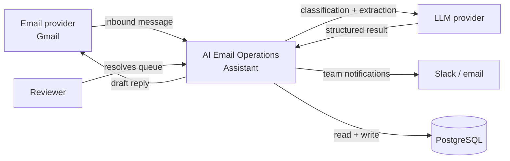
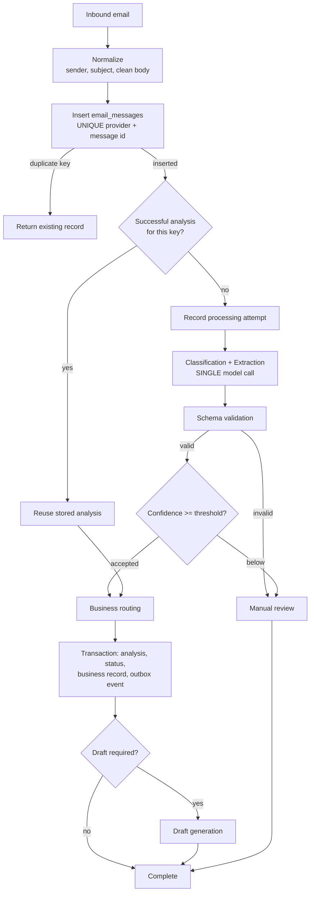
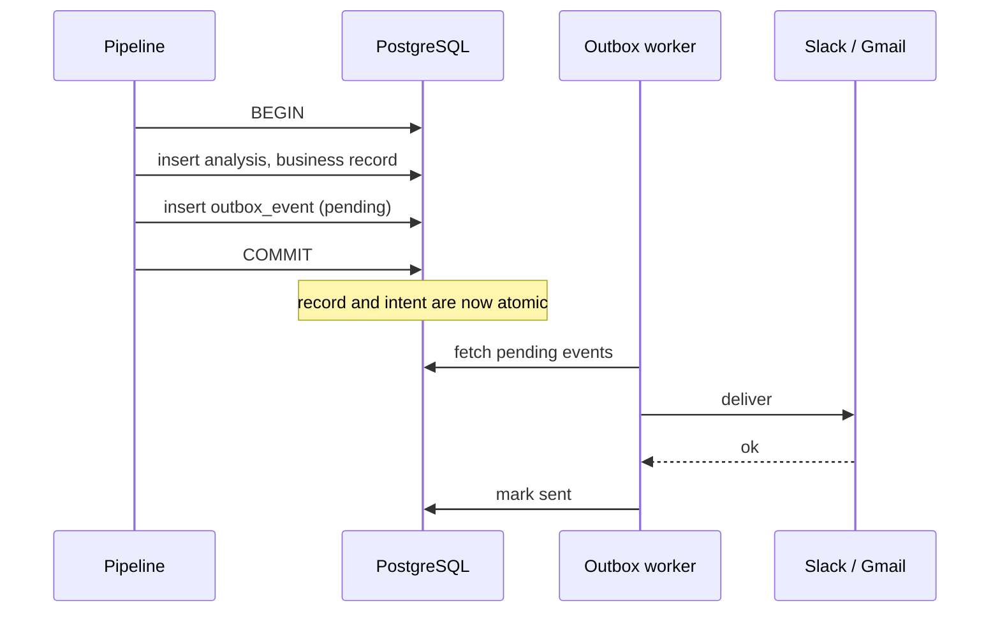

# Architecture

**Status:** Draft — Version 1
**Last updated:** 2026-07-31

This document describes how the AI Email Operations Assistant is structured and why. It assumes the requirements in [`requirements.md`](requirements.md) and the decisions recorded in [`decisions.md`](decisions.md).

---

## 1. Architectural principles

These four principles explain most of the structure that follows.

1. **Deterministic where possible, probabilistic where valuable.** Routing rules, retry policy, and idempotency are explicit code and schema constraints. Only genuinely language-shaped work — classification, extraction, drafting — is delegated to a model.
2. **The database is the source of truth, not the workflow.** Uniqueness and consistency are enforced by constraints. Workflow logic may optimize, but it never provides the guarantee.
3. **Expensive steps run last and only when needed.** Draft generation is the costliest operation, so it happens after confidence and routing have already justified it.
4. **Every decision is reconstructable.** Model, prompt version, confidence, threshold, and raw response are recorded on every analysis.

## 2. System context

The system owns its data. Every external party — mail provider, model provider, notification target — is treated as unreliable and is reached through a boundary that can retry.

## 3. Components

| Component | Directory | Responsibility |
| --- | --- | --- |
| **Ingestion & orchestration** | `n8n/` | Receives inbound mail, drives the pipeline, invokes the API service. Holds no business invariants of its own. |
| **API service** | `api/` | Owns everything that must be atomic or must not be duplicated: the transactional write block, the model abstraction, schema validation, and idempotency key derivation. |
| **Database** | `database/` | PostgreSQL. Schema, constraints, and migrations. The enforcement point for all uniqueness rules. |
| **Prompts** | `prompts/` | Versioned prompt templates. A prompt change is a release, not an edit. |
| **Outbox worker** | `n8n/` | Drains `outbox_events` and performs external side effects with retry. |
| **Review console** | *(Version 2)* | Human resolution of the review queue. Version 1 exposes state through the database and API only. |

**Why an API service rather than n8n talking to PostgreSQL directly.** n8n commits per node, so a transaction spanning several nodes is not reliable. Any operation that must be atomic — writing an analysis, updating message status, creating a business record, and enqueuing a notification — has to execute as one unit. That unit lives in `api/`. The same boundary owns the model abstraction required by ADR-002, so provider credentials and retry classification exist in exactly one place.

## 4. Processing flow

Two properties of this order matter, and both were deliberate.

**Classification and extraction are one model call, not two.** They read the same message and need the same context. Splitting them doubles the per-message cost and latency for no gain, and introduces the possibility of the two calls disagreeing — an extraction that assumes a category the classifier did not assign. A single schema-constrained response keeps them consistent by construction.

**Draft generation happens after confidence and routing, not before.** Drafting is the most expensive step and the only one whose output is written for a human to send. Running it before the confidence check would spend money drafting replies to spam, to messages the model did not understand, and to messages that will be rejected in review. Gating it means cost is incurred only for messages the system has already decided it understands and intends to answer.

## 5. Failure handling

Failure is the expected condition, not the exception. Three mechanisms cover it.

**Attempt records.** Every step writes a `processing_attempts` row before it runs and updates it on completion. Attempts are never overwritten, so a message that succeeded on the third try is distinguishable from one that succeeded immediately — the distinction that makes intermittent provider failures visible instead of invisible.

**Error classification.** Transient conditions (429, 5xx, timeout) are retried with backoff. Permanent conditions (4xx other than rate limiting, schema validation failure) are not retried; they go to review. Retrying a permanently malformed request only spends money more slowly.

**Terminal states are recorded, never implicit.** A message that cannot be processed ends in `failed` or `manual_review`. There is no path where a message stops being worked on without a row saying so.

## 6. Transactional outbox

An external service cannot participate in a database rollback. Committing a lead and notifying Slack in the same logical step therefore has two bad failure shapes: the notification is sent and the transaction rolls back, so Slack reports a lead that does not exist; or the lead commits and the notification fails, and retrying the step duplicates it.

The outbox resolves this by committing the business record and the *intent to notify* together, then dispatching separately.

Delivery is **at-least-once, not exactly-once**. If delivery succeeds and the subsequent mark-as-sent fails, the next sweep delivers again. Gmail draft creation can be keyed on the analysis and made idempotent; Slack offers no such key, so duplicate notifications are an accepted Version 1 failure mode. An outbox that nobody monitors is a silent queue of undelivered work, so pending events that are not clearing must alert.

Full reasoning is in [ADR-003](architecture/adr/ADR-003-idempotency.md).

## 7. Security

- Credentials are supplied through environment variables only. `.env.example` documents the required keys with empty or placeholder values; no secret is committed.
- The model provider is reached through one abstraction, so credentials exist at a single point rather than embedded across workflow nodes.
- Each integration holds the narrowest permission that lets it function — read and draft-create on the mailbox, not send.
- Version 1 processes fictional data only. Real deployment requires a defined retention period, redaction of obvious secrets before transmission to a third party, and an explicit position on data residency.
- Message bodies leave the trust boundary when sent to the model provider. This is the system's most significant privacy exposure and is recorded as such in [ADR-002](architecture/adr/ADR-002-ai-provider.md).

## 8. Deployment

Local development runs through Docker Compose in `docker/`: PostgreSQL, n8n, and the API service. No dependency is expected to be installed on the host beyond a container runtime.

Configuration is environment-driven, so the same images run locally and in a hosted environment with different values. Managed PostgreSQL is available from every major provider, so the database is not a hosting lock-in.

## 9. Scaling notes

At the design target of 5,000 messages per day the constraint is not compute — it is the model provider's rate limits and per-token cost.

- Arrival is uneven; the queue absorbs bursts, and the outbox decouples notification delivery from processing.
- Classification runs against a truncated body where the full text adds no signal.
- The cheapest model that passes evaluation is used for classification; the stronger model is reserved for drafting.
- The database is not expected to be the bottleneck at this volume. Indexes on message status, category, team, and receipt time keep review and audit queries responsive as history accumulates.

## 10. Open items

Carried from ADR-003 and not yet resolved:

1. **Current analysis.** Reprocessing deliberately creates a second analysis; nothing yet marks which is in force.
2. **No lease on `processing`.** A worker that dies mid-run leaves a message in `processing` permanently, with no sweeper to reclaim it.
3. **Outbox ordering.** Version 1 assumes events for an entity are independent.
4. **Category taxonomy** is not yet closed, so it cannot yet be enforced as a database enum.
