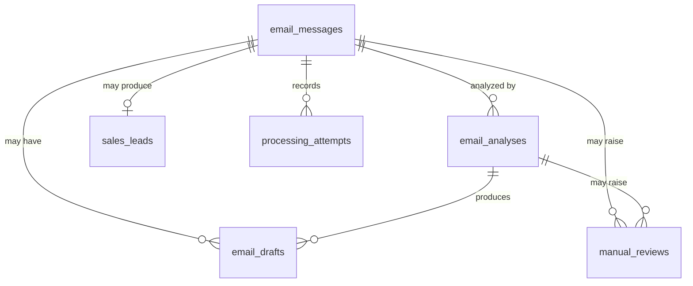

# Data Model

**Status:** Draft — Version 1
**Last updated:** 2026-07-31

The data model exists to answer questions after the fact, not merely to store model output:

- Which email was processed, and once or more than once?
- What did the model decide, using which model and which prompt version?
- Was that decision accepted, or sent for review?
- Was a draft generated, and from which analysis?
- Did any step fail, and how many times before it succeeded?
- Can an administrator reprocess it without destroying what happened before?

The store is PostgreSQL, as decided in [ADR-001](architecture/adr/ADR-001-database-choice.md). Constraint names and uniqueness rules follow [ADR-003](architecture/adr/ADR-003-idempotency.md), which is the authority on why they exist.

---

## 1. Design principles

**Three concerns stay separate.** Source email data, model output, and execution history are distinct tables. Collapsing them into one wide record makes the history unauditable, because each reprocessing would overwrite the evidence of the last.

**History is append-only.** Analyses, drafts, and attempts accumulate. Reprocessing after a prompt change adds a record; it does not replace one.

**Invariants live in the schema.** Every uniqueness rule below is a database constraint, not a workflow check. See ADR-003 for why the check-then-insert alternative does not hold under concurrency.

## 2. Entity relationships



`outbox_events` is intentionally not related by foreign key — it references business entities polymorphically so that any entity type can enqueue an external effect.

**Why multiple analyses and drafts per email.** An administrator may reprocess a message after changing a prompt, changing a model, correcting the message content, or fixing an integration. Earlier results are evidence of what the system decided at the time and are preserved rather than overwritten.

---

## 3. `email_messages`

The normalized inbound email. One row per source message, however many times it is delivered.

| Field | Type | Null | Purpose |
| --- | --- | --- | --- |
| `id` | UUID | no | Primary key |
| `provider` | text | no | `gmail`, `outlook`, `webhook` |
| `provider_message_id` | text | no | Identifier assigned by the source system |
| `thread_id` | text | yes | Groups related messages |
| `from_email` | text | no | Sender address |
| `from_name` | text | yes | Sender display name |
| `to_email` | text | no | Recipient address |
| `subject` | text | no | Subject, empty string if absent |
| `body_text` | text | no | Cleaned plain-text body |
| `received_at` | timestamptz | no | Arrival time at the provider |
| `has_attachments` | boolean | no | Presence only; content is not parsed in V1 |
| `processing_status` | enum | no | Lifecycle state, default `received` |
| `created_at` | timestamptz | no | Record creation |
| `updated_at` | timestamptz | no | Last modification |

**Constraints**

| Rule | Purpose |
| --- | --- |
| `UNIQUE (provider, provider_message_id)` | The system's deduplication guarantee. Webhook redelivery hits this constraint and returns the existing row. |

**Indexes:** `(processing_status, received_at)` for queue scans, `(thread_id)`, `(from_email)`.

**Status lifecycle**

```
received → processing → processed
                     → manual_review
                     → failed
received → ignored
```

| Status | Meaning |
| --- | --- |
| `received` | Persisted, not yet worked on |
| `processing` | Claimed by an execution |
| `processed` | Completed successfully |
| `manual_review` | Awaiting human resolution |
| `failed` | Permanently failed; not retryable without intervention |
| `ignored` | Deliberately excluded, e.g. automated bounce |

---

## 4. `email_analyses`

Classification and extraction output. Written by a single model call (see [architecture.md](architecture.md#4-processing-flow)).

| Field | Type | Null | Purpose |
| --- | --- | --- | --- |
| `id` | UUID | no | Primary key |
| `email_message_id` | UUID | no | → `email_messages.id` |
| `category` | text | no | Classified category |
| `priority` | enum | no | `low`, `medium`, `high`, `critical` |
| `confidence` | numeric(4,3) | no | Model confidence, 0.000–1.000 |
| `confidence_threshold` | numeric(4,3) | no | Threshold applied **at the time of this decision** |
| `summary` | text | yes | Short generated summary |
| `recommended_action` | text | yes | Suggested next step |
| `requires_draft` | boolean | no | Whether a draft should be generated |
| `requires_manual_review` | boolean | no | Whether a human must review |
| `model_name` | text | no | Pinned model identifier |
| `prompt_version` | text | no | e.g. `email-classifier-v1.0` |
| `input_hash` | text | no | Hash of the normalized input |
| `idempotency_key` | text | no | See below |
| `raw_response` | jsonb | no | Unmodified model output |
| `created_at` | timestamptz | no | Analysis time |

**Constraints**

| Rule | Purpose |
| --- | --- |
| `UNIQUE (idempotency_key)` | One stored analysis per logical classification operation |

**Indexes:** `(email_message_id, created_at DESC)`.

**Idempotency key**

```
classification : <email_message_id> : <prompt_version> : <model_name> : <input_hash>
```

`input_hash` is computed over sender address, subject, and cleaned body with whitespace collapsed — and nothing else. Timestamps, headers, and provider identifiers are excluded: any volatile input makes the key unmatchable on retry and silently disables the deduplication it exists to provide.

A deliberate prompt or model change produces a different key and therefore a new analysis. That is the intended reprocessing behavior.

**Why `confidence_threshold` is stored.** The threshold is configurable. Without recording the value in force at decision time, a later change makes every historical review decision uninterpretable — it becomes impossible to tell which reviews the old rule produced.

**Why `prompt_version` is stored.** If `email-classifier-v1.0` performs poorly and `v2.0` replaces it, the messages processed under each must be identifiable. This is the difference between an auditable system and one that merely works today.

---

## 5. `sales_leads`

Created only when the category is a sales inquiry. Business data is kept out of the analysis table so that CRM-shaped concerns do not contaminate the model-output record.

| Field | Type | Null |
| --- | --- | --- |
| `id` | UUID | no |
| `email_message_id` | UUID | no |
| `customer_name` | text | yes |
| `customer_type` | text | yes |
| `company_name` | text | yes |
| `contact_email` | text | no |
| `phone` | text | yes |
| `address` | text | yes |
| `website` | text | yes |
| `service_requested` | text | yes |
| `requirement_summary` | text | yes |
| `budget_amount` | numeric(14,2) | yes |
| `budget_currency` | char(3) | yes |
| `urgency` | text | yes |
| `lead_status` | enum | no |
| `created_at` | timestamptz | no |
| `updated_at` | timestamptz | no |

**Constraints**

| Rule | Purpose |
| --- | --- |
| `UNIQUE (email_message_id)` | Version 1 assumes at most one lead per email |

Nearly every field is nullable because extraction is best-effort: a sales email that omits a budget is still a lead. Only `contact_email` is required, because a lead with no way to reply is not a lead.

---

## 6. `email_drafts`

Drafts are separate from analyses because a draft may be regenerated, may be edited by a human, and may end up differing from what the model produced. Many messages never have one.

| Field | Type | Null | Purpose |
| --- | --- | --- | --- |
| `id` | UUID | no | Primary key |
| `email_message_id` | UUID | no | → `email_messages.id` |
| `analysis_id` | UUID | no | → `email_analyses.id` |
| `draft_version` | integer | no | 1, 2, 3 … |
| `draft_subject` | text | no | Proposed reply subject |
| `draft_body` | text | no | Proposed reply body |
| `status` | enum | no | Draft lifecycle |
| `model_name` | text | no | Model used |
| `prompt_version` | text | no | Draft prompt version |
| `idempotency_key` | text | no | `draft:<analysis_id>:<prompt_version>` |
| `created_at` | timestamptz | no | Creation |
| `updated_at` | timestamptz | no | Last modification |

**Constraints**

| Rule | Purpose |
| --- | --- |
| `UNIQUE (email_message_id, analysis_id, draft_version)` | Multiple versions are legitimate; the same version twice is not |
| `UNIQUE (idempotency_key)` | A workflow retry cannot create a second version 1 |

**Status values:** `generated` → `reviewed` → `approved` / `edited` / `discarded` → `sent`.

`sent` exists in the vocabulary but is unreachable in Version 1, which creates drafts and never sends them (FR-13).

---

## 7. `processing_attempts`

The table that makes retries visible. Without it, the system records only that processing eventually succeeded — not that the first two attempts timed out.

| Field | Type | Null | Purpose |
| --- | --- | --- | --- |
| `id` | UUID | no | Primary key |
| `email_message_id` | UUID | no | → `email_messages.id` |
| `step_name` | text | no | e.g. `classify_email`, `generate_draft` |
| `attempt_number` | integer | no | 1-based retry counter |
| `status` | enum | no | `started`, `success`, `failed` |
| `error_type` | text | yes | Error category, e.g. `timeout`, `rate_limit` |
| `error_message` | text | yes | Failure detail |
| `http_status_code` | integer | yes | Provider response status |
| `execution_id` | text | yes | n8n execution identifier |
| `started_at` | timestamptz | no | Attempt start |
| `completed_at` | timestamptz | yes | Attempt completion |
| `duration_ms` | integer | yes | Elapsed time |

**Constraints**

| Rule | Purpose |
| --- | --- |
| `UNIQUE (email_message_id, step_name, attempt_number)` | Preserves every attempt while preventing the same attempt being recorded twice |

**Indexes:** `(email_message_id, step_name)`.

Example history — the value of the table is that all three rows survive:

| Email | Step | Attempt | Status | Error |
| --- | --- | --- | --- | --- |
| msg-001 | `classify_email` | 1 | failed | timeout |
| msg-001 | `classify_email` | 2 | failed | rate_limit |
| msg-001 | `classify_email` | 3 | success | — |

**Note on concurrency.** Allocating `attempt_number` is itself a race: two executions can both read the current maximum and both write the next value. The unique constraint catches this, and the resulting duplicate-key error means *another execution owns this step* — the correct response is to yield, not to retry into a loop.

---

## 8. `manual_reviews`

| Field | Type | Null | Purpose |
| --- | --- | --- | --- |
| `id` | UUID | no | Primary key |
| `email_message_id` | UUID | no | → `email_messages.id` |
| `analysis_id` | UUID | yes | Analysis under review, if any |
| `reason` | enum | no | Why review is required |
| `status` | enum | no | Review state |
| `assigned_to` | text | yes | Reviewer |
| `review_notes` | text | yes | Human comments |
| `resolved_category` | text | yes | Corrected category |
| `resolved_at` | timestamptz | yes | Completion |
| `created_at` | timestamptz | no | Queue time |

**Reasons:** `low_confidence`, `invalid_ai_response`, `unsupported_attachment`, `suspicious_content`, `missing_required_data`, `processing_failed`.

**Statuses:** `pending` → `in_review` → `resolved` / `dismissed`.

**Constraints**

| Rule | Purpose |
| --- | --- |
| `UNIQUE (email_message_id, analysis_id, reason)` | A new analysis may raise a new review; the same analysis may not raise the same one twice |

`status` is deliberately excluded from that key. Including it would let a resolved review be recreated with a different status, defeating the constraint.

> **Known gap.** `analysis_id` is nullable, and in PostgreSQL distinct `NULL`s do not collide. Reviews raised before any analysis exists — a failure during ingestion, for instance — will therefore **not** be deduplicated by an ordinary unique index. This requires `NULLS NOT DISTINCT` (PostgreSQL 15+), a partial index, or a sentinel value. It is a real gap, not a theoretical one.

---

## 9. `outbox_events`

Required by ADR-003. The business record and the intent to notify are committed in one transaction; delivery happens separately.

| Field | Type | Null | Purpose |
| --- | --- | --- | --- |
| `id` | UUID | no | Primary key |
| `event_type` | text | no | e.g. `sales_lead_created` |
| `entity_type` | text | no | e.g. `sales_lead` |
| `entity_id` | UUID | no | Identifier of the referenced entity |
| `payload` | jsonb | no | Everything the consumer needs, captured at commit time |
| `status` | enum | no | `pending`, `sent`, `failed`, `dead` |
| `attempts` | integer | no | Delivery attempts made |
| `last_error` | text | yes | Most recent failure |
| `available_at` | timestamptz | no | Earliest next delivery, for backoff |
| `created_at` | timestamptz | no | Enqueued |
| `sent_at` | timestamptz | yes | Delivered |

**Indexes:** `(status, available_at)` — the worker's only query pattern.

The `payload` is self-contained by design: a consumer must not need to re-read the entity, whose state may have moved on since the event was raised.

`dead` is a terminal state for events that exhausted retries. Events reaching it require intervention and must alert — an outbox nobody watches is a silent queue of undelivered work.

---

## 10. Data we deliberately do not store

Email bodies can contain anything. The system does not retain, and where detected should redact:

passwords · one-time codes · card numbers · bank credentials · authentication tokens · identity documents · full raw headers unless needed · attachment contents

This repository uses **fictional test emails only**. A real deployment requires agreement on retention duration, encryption at rest, access control, data residency, log redaction, and deletion on request — none of which are settled here.

---

## 11. Build order

| Stage | Tables |
| --- | --- |
| First working slice | `email_messages`, `email_analyses`, `processing_attempts`, `email_drafts` |
| Completing the Version 1 flow | `manual_reviews`, `sales_leads`, `outbox_events` |

This is a build order, not a feature split. The full Version 1 flow — low-confidence review, lead capture, team notification — needs all seven tables. The first four simply produce something that runs end to end soonest.

## 12. Open items

1. **Which analysis is current.** Reprocessing creates a second analysis and nothing marks which is in force. Ordering by `created_at` breaks under concurrency; an explicit `superseded_by` reference or an `is_current` flag with a partial unique index is needed.
2. **No lease on `processing`.** A worker that dies leaves the row claimed permanently. A `claimed_at` column plus a sweeper reclaiming rows past a threshold would close this.
3. **`NULL` handling in the review key** — section 8.
4. **Category taxonomy is not closed**, so `category` remains `text` rather than an enum. It cannot be constrained until the vocabulary is fixed.
5. **`lead_status` values** are not yet agreed with any business process.
6. **Retention policy** is undefined, so no deletion or archival mechanism is specified.
