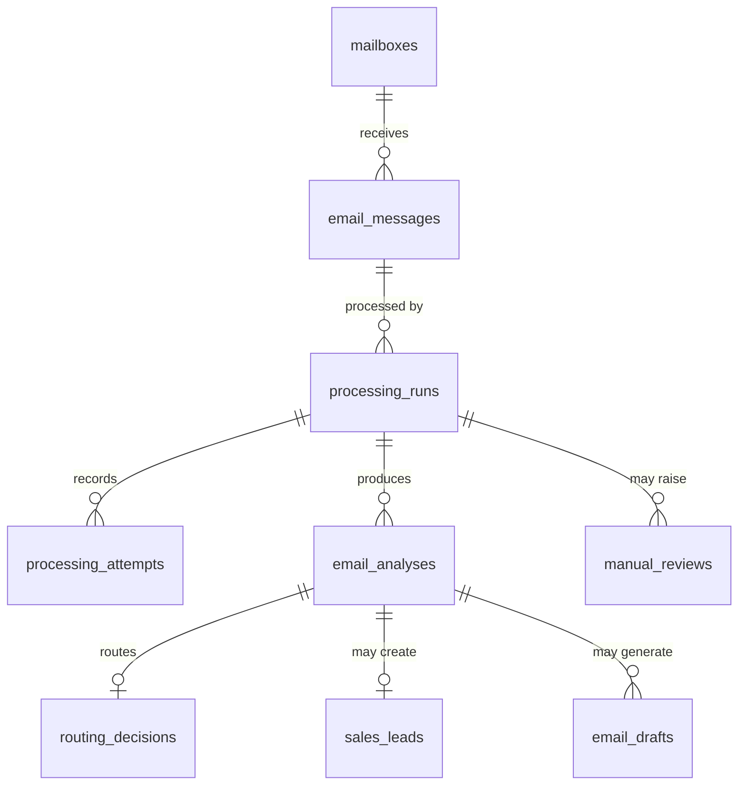

# Data Model

**Status:** Draft - Version 1 logical model
**Last updated:** 2026-08-02

This document defines the logical data model for the AI Email Operations Assistant.
It intentionally comes before SQL migrations. The goal is to settle ownership,
state, idempotency, auditability, and recovery semantics before we turn decisions
into PostgreSQL constraints.

The model exists to answer operational and audit questions after the fact:

- Which source email was received, and was it delivered more than once?
- Which processing run handled it, and why was that run started?
- Which model and prompt produced the analysis?
- Which routing decision was accepted as current?
- Was a sales lead, draft, review item, or notification produced?
- Which attempts failed before the final outcome?
- Can an administrator reprocess without destroying earlier evidence?

The store is PostgreSQL, as decided in [ADR-001](architecture/adr/ADR-001-database-choice.md).
Idempotency and transactional outbox rules follow [ADR-003](architecture/adr/ADR-003-idempotency.md).

---

## 1. Design principles

**Separate business facts from execution history.** An email, an analysis, a
route, a draft, and an attempt are different things. Combining them into one wide
record would make retries and reprocessing hard to audit.

**Treat reprocessing as a first-class concept.** A message may be processed once
initially and later reprocessed after a prompt, model, threshold, or integration
change. That second pass is not a retry; it is a new run.

**Retries stay inside a run.** Transient failures such as timeouts and rate
limits create more `processing_attempts` for the same `processing_run`. They do
not create a new analysis or a new business decision unless the step eventually
succeeds.

**Current state is explicit.** Historical records are preserved, but the system
still needs one current accepted outcome per email. That pointer is represented
through `processing_runs.is_current`, protected by a partial unique index.

**External side effects are outbox-driven.** The database transaction records
the business result and the intent to notify. Slack, email, or webhook delivery
happens later from `outbox_events`.

---

## 2. Entity relationships



`outbox_events` intentionally has no foreign key to one specific business table.
It references entities polymorphically so any committed outcome can enqueue an
external effect.

Core ownership rule:

```text
email_message -> processing_run -> analysis -> route / lead / draft / review
```

The email is the source fact. The processing run is the execution boundary. The
analysis is the model decision. The downstream records are business outcomes of
that decision.

---

## 3. `mailboxes`

The configured inbound mailbox or shared inbox. Version 1 integrates only one
provider/mailbox, but modelling this now avoids hard-coding provider assumptions
into every email row.

| Field | Type | Null | Purpose |
| --- | --- | --- | --- |
| `id` | UUID | no | Primary key |
| `provider` | text | no | `gmail`, `outlook`, `webhook` |
| `address` | text | no | Shared inbox address |
| `display_name` | text | yes | Human-friendly mailbox name |
| `is_active` | boolean | no | Whether ingestion is enabled |
| `created_at` | timestamptz | no | Record creation |
| `updated_at` | timestamptz | no | Last modification |

**Constraints**

| Rule | Purpose |
| --- | --- |
| `UNIQUE (provider, address)` | Prevents duplicate configuration for the same inbox |

---

## 4. `email_messages`

The normalized inbound email. One row exists per source message, no matter how
many times the provider delivers it.

| Field | Type | Null | Purpose |
| --- | --- | --- | --- |
| `id` | UUID | no | Primary key |
| `mailbox_id` | UUID | no | -> `mailboxes.id` |
| `provider` | text | no | Copied from the source for idempotency and audit |
| `provider_message_id` | text | no | Stable identifier assigned by the provider |
| `thread_id` | text | yes | Provider thread or conversation identifier |
| `from_email` | text | no | Sender address |
| `from_name` | text | yes | Sender display name |
| `to_emails` | text[] | no | Normalized recipients; Version 1 may contain one |
| `cc_emails` | text[] | no | Empty array when absent |
| `subject` | text | no | Empty string if absent |
| `body_text` | text | no | Cleaned plain-text body |
| `received_at` | timestamptz | no | Arrival time at the provider |
| `has_attachments` | boolean | no | Presence only; content is not parsed in Version 1 |
| `ingestion_status` | enum | no | `received`, `ignored`, `quarantined` |
| `created_at` | timestamptz | no | Record creation |
| `updated_at` | timestamptz | no | Last modification |

**Constraints**

| Rule | Purpose |
| --- | --- |
| `UNIQUE (provider, provider_message_id)` | Deduplicates provider redelivery |

**Indexes:** `(mailbox_id, received_at DESC)`, `(thread_id)`, `(from_email)`.

Why the old `processing_status` moves out: processing is not a property of the
email itself once reprocessing exists. The email can have many runs, so run state
belongs in `processing_runs`.

---

## 5. `processing_runs`

A processing run is one deliberate pass over an email. This is the central
execution boundary for retries, leases, reprocessing, and current outcome.

| Field | Type | Null | Purpose |
| --- | --- | --- | --- |
| `id` | UUID | no | Primary key |
| `email_message_id` | UUID | no | -> `email_messages.id` |
| `parent_run_id` | UUID | yes | Previous run that motivated this one |
| `trigger_type` | enum | no | `initial`, `manual_reprocess`, `retry_recovery`, `system_replay` |
| `triggered_by` | text | yes | User, service, or workflow that started it |
| `idempotency_key` | text | no | Stable key for this logical run |
| `status` | enum | no | Run lifecycle |
| `is_current` | boolean | no | Whether this run is the accepted current outcome |
| `config_snapshot` | jsonb | no | Thresholds, routing version, orchestration version |
| `claimed_by` | text | yes | Worker currently holding the lease |
| `lease_expires_at` | timestamptz | yes | Claim expiry for stuck-run recovery |
| `started_at` | timestamptz | yes | Actual processing start |
| `completed_at` | timestamptz | yes | Terminal time |
| `created_at` | timestamptz | no | Record creation |
| `updated_at` | timestamptz | no | Last modification |

**Status values:** `queued`, `processing`, `completed`, `manual_review`, `failed`,
`cancelled`, `superseded`.

**Constraints**

| Rule | Purpose |
| --- | --- |
| `UNIQUE (idempotency_key)` | Prevents duplicate logical runs |
| `UNIQUE (email_message_id) WHERE is_current = true` | Allows only one current accepted run per email |
| `UNIQUE (email_message_id) WHERE status IN ('queued', 'processing')` | Prevents two active workers from processing the same email |

The active-run constraint is conservative. It means we cannot run two competing
experiments on the same message at the same time. For Version 1 that is a good
trade-off: we are optimizing for correctness and low model spend, not research
parallelism.

---

## 6. `processing_attempts`

Attempts make retries visible. Without this table the system can say only that
processing eventually succeeded, not that two provider calls failed first.

| Field | Type | Null | Purpose |
| --- | --- | --- | --- |
| `id` | UUID | no | Primary key |
| `processing_run_id` | UUID | no | -> `processing_runs.id` |
| `step_name` | text | no | `ingest`, `classify_extract`, `route`, `generate_draft`, `notify` |
| `attempt_number` | integer | no | 1-based retry counter within the run and step |
| `status` | enum | no | `started`, `success`, `failed` |
| `error_type` | text | yes | `timeout`, `rate_limit`, `validation_error`, etc. |
| `error_message` | text | yes | Failure detail safe for logs |
| `http_status_code` | integer | yes | Provider response status |
| `execution_id` | text | yes | n8n execution identifier or API request id |
| `started_at` | timestamptz | no | Attempt start |
| `completed_at` | timestamptz | yes | Attempt completion |
| `duration_ms` | integer | yes | Elapsed time |

**Constraints**

| Rule | Purpose |
| --- | --- |
| `UNIQUE (processing_run_id, step_name, attempt_number)` | Keeps attempt numbering stable inside a run |

**Indexes:** `(processing_run_id, step_name)`, `(status, started_at)`.

---

## 7. `email_analyses`

The validated classification and extraction result from the single model call
required by FR-4.

| Field | Type | Null | Purpose |
| --- | --- | --- | --- |
| `id` | UUID | no | Primary key |
| `processing_run_id` | UUID | no | -> `processing_runs.id` |
| `email_message_id` | UUID | no | Denormalized for common queries |
| `category` | text | no | Classified category; text until taxonomy is closed |
| `priority` | enum | no | `low`, `medium`, `high`, `critical` |
| `confidence` | numeric(4,3) | no | Model confidence, 0.000-1.000 |
| `confidence_threshold` | numeric(4,3) | no | Threshold applied at decision time |
| `summary` | text | yes | Short generated summary |
| `recommended_action` | text | yes | Suggested next step |
| `requires_draft` | boolean | no | Whether a reply draft should be generated |
| `requires_manual_review` | boolean | no | Whether a human must review |
| `extracted_payload` | jsonb | no | Validated structured fields used by the app |
| `raw_response` | jsonb | no | Unmodified model response |
| `model_name` | text | no | Pinned model identifier |
| `prompt_version` | text | no | e.g. `email-classifier-v1.0` |
| `schema_version` | text | no | Validation schema version |
| `input_hash` | text | no | Hash of normalized model input |
| `idempotency_key` | text | no | Stable key for this model operation |
| `created_at` | timestamptz | no | Analysis time |

**Constraints**

| Rule | Purpose |
| --- | --- |
| `UNIQUE (processing_run_id)` | One accepted analysis per run |
| `UNIQUE (idempotency_key)` | A workflow retry cannot store duplicate analysis output |

**Indexes:** `(email_message_id, created_at DESC)`, `(category, priority)`.

The split between `extracted_payload` and `raw_response` matters. The application
uses only the validated payload. The raw response is evidence for debugging and
auditing, not trusted business data.

---

## 8. `routing_decisions`

The accepted route derived from an analysis.

| Field | Type | Null | Purpose |
| --- | --- | --- | --- |
| `id` | UUID | no | Primary key |
| `processing_run_id` | UUID | no | -> `processing_runs.id` |
| `analysis_id` | UUID | no | -> `email_analyses.id` |
| `owning_team` | text | no | `sales`, `support`, `billing`, etc. |
| `route_reason` | text | yes | Human-readable explanation |
| `routing_rule_version` | text | no | Version of routing rules applied |
| `created_at` | timestamptz | no | Decision time |

**Constraints**

| Rule | Purpose |
| --- | --- |
| `UNIQUE (processing_run_id)` | A run has one accepted routing decision |
| `UNIQUE (analysis_id)` | One route per analysis |

Routing deserves its own table because FR-8 and NFR-4 require reconstructable
routing decisions. Hiding it inside `email_analyses` would make model output and
business policy look like one thing.

---

## 9. `sales_leads`

Created only when the accepted category is a sales inquiry.

| Field | Type | Null | Purpose |
| --- | --- | --- | --- |
| `id` | UUID | no | Primary key |
| `processing_run_id` | UUID | no | -> `processing_runs.id` |
| `analysis_id` | UUID | no | -> `email_analyses.id` |
| `email_message_id` | UUID | no | Denormalized for lookup |
| `customer_name` | text | yes | Extracted customer name |
| `customer_type` | text | yes | Individual, company, partner, etc. |
| `company_name` | text | yes | Extracted company name |
| `contact_email` | text | no | Replyable email address |
| `phone` | text | yes | Extracted phone number |
| `address` | text | yes | Extracted address |
| `website` | text | yes | Extracted website |
| `service_requested` | text | yes | Product or service requested |
| `requirement_summary` | text | yes | Business summary |
| `budget_amount` | numeric(14,2) | yes | Extracted budget |
| `budget_currency` | char(3) | yes | ISO currency code |
| `urgency` | text | yes | Extracted urgency |
| `lead_status` | enum | no | `new`, `review_required`, `qualified`, `discarded` |
| `created_at` | timestamptz | no | Creation |
| `updated_at` | timestamptz | no | Last modification |

**Constraints**

| Rule | Purpose |
| --- | --- |
| `UNIQUE (processing_run_id)` | Version 1 creates at most one lead per run |
| `UNIQUE (analysis_id)` | Prevents duplicate lead creation from the same analysis |

Version 1 assumes one lead per email, but the uniqueness is attached to the run
and analysis rather than the email. That leaves room for reprocessing to produce
a corrected lead while preserving the earlier one.

---

## 10. `email_drafts`

Drafts are separate from analyses because they can be regenerated, edited,
approved, or discarded independently.

| Field | Type | Null | Purpose |
| --- | --- | --- | --- |
| `id` | UUID | no | Primary key |
| `processing_run_id` | UUID | no | -> `processing_runs.id` |
| `analysis_id` | UUID | no | -> `email_analyses.id` |
| `email_message_id` | UUID | no | Denormalized for lookup |
| `draft_version` | integer | no | 1, 2, 3... |
| `draft_subject` | text | no | Proposed reply subject |
| `draft_body` | text | no | Proposed reply body |
| `status` | enum | no | Draft lifecycle |
| `model_name` | text | no | Pinned model identifier |
| `prompt_version` | text | no | Draft prompt version |
| `input_hash` | text | no | Hash of draft-generation input |
| `idempotency_key` | text | no | Stable key for this draft operation |
| `created_at` | timestamptz | no | Creation |
| `updated_at` | timestamptz | no | Last modification |

**Constraints**

| Rule | Purpose |
| --- | --- |
| `UNIQUE (analysis_id, draft_version)` | Allows regenerated versions without duplicate numbering |
| `UNIQUE (idempotency_key)` | A retry cannot create another version 1 |

**Status values:** `generated`, `reviewed`, `approved`, `edited`, `discarded`.

`sent` is deliberately excluded in Version 1 because FR-13 says the system does
not send replies. Adding a status that cannot happen makes operational reports
less honest.

---

## 11. `manual_reviews`

Manual review items represent work for a trusted internal reviewer.

| Field | Type | Null | Purpose |
| --- | --- | --- | --- |
| `id` | UUID | no | Primary key |
| `processing_run_id` | UUID | no | -> `processing_runs.id` |
| `email_message_id` | UUID | no | Denormalized for lookup |
| `analysis_id` | UUID | yes | Analysis under review, if one exists |
| `reason` | enum | no | Why review is required |
| `status` | enum | no | Review lifecycle |
| `assigned_to` | text | yes | Reviewer identifier |
| `review_notes` | text | yes | Human comments |
| `resolved_category` | text | yes | Corrected category |
| `resolved_at` | timestamptz | yes | Completion |
| `created_at` | timestamptz | no | Queue time |
| `updated_at` | timestamptz | no | Last modification |

**Reasons:** `low_confidence`, `invalid_ai_response`, `unsupported_attachment`,
`suspicious_content`, `missing_required_data`, `processing_failed`.

**Statuses:** `pending`, `in_review`, `resolved`, `dismissed`.

**Constraints**

| Rule | Purpose |
| --- | --- |
| `UNIQUE NULLS NOT DISTINCT (processing_run_id, analysis_id, reason)` | Deduplicates reviews even when no analysis exists |

The `NULLS NOT DISTINCT` choice depends on PostgreSQL 15+, which is compatible
with our PostgreSQL 16 Docker decision.

---

## 12. `outbox_events`

Outbox events record external effects that must happen after the business
transaction commits.

| Field | Type | Null | Purpose |
| --- | --- | --- | --- |
| `id` | UUID | no | Primary key |
| `event_type` | text | no | `message_routed`, `sales_lead_created`, etc. |
| `entity_type` | text | no | `routing_decision`, `sales_lead`, `manual_review` |
| `entity_id` | UUID | no | Identifier of the referenced entity |
| `dedupe_key` | text | no | Consumer-visible idempotency key |
| `payload` | jsonb | no | Self-contained event payload |
| `status` | enum | no | `pending`, `processing`, `sent`, `failed`, `dead` |
| `attempts` | integer | no | Delivery attempts made |
| `last_error` | text | yes | Most recent failure |
| `available_at` | timestamptz | no | Earliest next delivery time |
| `claimed_by` | text | yes | Worker holding the delivery lease |
| `lease_expires_at` | timestamptz | yes | Claim expiry for delivery recovery |
| `created_at` | timestamptz | no | Enqueued |
| `sent_at` | timestamptz | yes | Delivered |

**Constraints**

| Rule | Purpose |
| --- | --- |
| `UNIQUE (dedupe_key)` | Prevents duplicate notification intent |

**Indexes:** `(status, available_at)`, `(lease_expires_at) WHERE status = 'processing'`.

The payload is self-contained by design. A consumer should not need to re-read
the business entity, because that entity may have changed since the event was
raised.

---

## 13. Current outcome rule

Only a completed or manual-review run may become current.

When a reprocess succeeds, the transaction should:

1. Set the old current run to `is_current = false`.
2. Mark the new run as `is_current = true`.
3. Commit the new analysis, route, optional lead, optional draft, and outbox
   events together.

If the transaction fails, the old current outcome remains intact.

This is intentionally a small mutable pointer on top of append-only evidence.
That is the right trade-off: operators need a current answer, while auditors need
the full history.

---

## 14. Data we deliberately do not store

Email bodies can contain anything. The system does not retain, and where detected
should redact:

passwords, one-time codes, card numbers, bank credentials, authentication
tokens, identity documents, full raw headers unless needed, and attachment
contents.

This repository uses fictional test emails only. A real deployment requires
agreement on retention duration, encryption at rest, access control, data
residency, log redaction, and deletion on request.

---

## 15. Build order

| Stage | Tables |
| --- | --- |
| Foundation | `mailboxes`, `email_messages`, `processing_runs`, `processing_attempts` |
| First AI decision slice | `email_analyses`, `manual_reviews` |
| Business outcome slice | `routing_decisions`, `sales_leads`, `email_drafts` |
| External effect slice | `outbox_events` |

This is a build order, not a feature split. The full Version 1 flow needs all
tables, but the foundation gives us durable ingestion and observable processing
before we spend model calls.

---

## 16. Open items

1. **Category taxonomy.** Categories remain `text` until the business vocabulary
   is closed and tested against fixtures.
2. **Confidence threshold calibration.** The schema records thresholds, but the
   actual value must come from labelled examples.
3. **Retention policy.** Message bodies, raw responses, and event payloads need a
   documented deletion or archival policy before real data is processed.
4. **Reviewer identity.** Version 1 stores reviewer identifiers as text. A real
   review UI needs user identity and authorization.
5. **Outbox ordering.** Version 1 guarantees dedupe and retry, not strict ordered
   delivery across event types.
